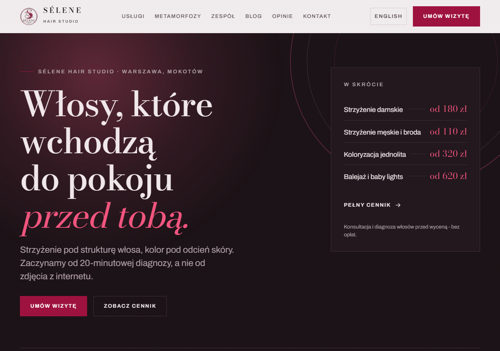

# Sélene Hair Studio

Strona salonu fryzjerskiego z rezerwacją online, blogiem i pełną wersją dwujęzyczną.
Projekt pokazowy - fikcyjny salon, prawdziwy kod.



**Stack:** Next.js 15 (App Router) · TypeScript · Prisma · Zod · next-intl · Vitest · Playwright + axe

---

## Co jest tu ciekawego

Większość stron salonów to statyczny layout z formularzem, który wysyła e-mail.
Tutaj interesujące są trzy rzeczy, których nie widać na pierwszym zrzucie ekranu.

### 1. Silnik wolnych terminów

`src/lib/availability.ts` to czysta funkcja bez zależności od bazy, sieci i zegara systemowego.
Dostaje godziny otwarcia, czas trwania usługi, listę osób, które ją wykonują, oraz istniejące
rezerwacje - zwraca okna startowe z informacją, które są wolne.

Rzeczy, które faktycznie musiał obsłużyć:

- **Usługa musi zmieścić się przed zamknięciem**, razem z buforem na sprzątnięcie stanowiska.
  Balejaż trwa 210 minut, więc we wtorek ostatni możliwy start to 16:00, a nie 19:30.
- **Styk nie jest kolizją.** Wizyta kończąca się o 11:15 nie blokuje wizyty o 11:30, bo bufor
  jest już wliczony w `endMin`.
- **„Dowolna osoba" to nie brak osoby.** Takie zgłoszenie zajmuje realny fotel, więc dopóki
  ktoś nie zostanie przypisany, blokuje wszystkich kandydatów - inaczej ten sam termin
  sprzedałby się dwa razy.
- **Godziny są liczone w minutach od północy**, nie jako `Date`. Salon myśli kategoriami
  „wtorek, 10:00" i wizyta nie może zmienić godziny przy zmianie czasu. Konwersja na
  znacznik czasu dzieje się raz, na granicy systemu.

24 testy jednostkowe (`npm test`) pokrywają dni zamknięte, granice godzin otwarcia,
nakładanie się rezerwacji, wyprzedzenie i logikę „dowolnej osoby".

### 2. Walidacja, która nie ufa przeglądarce

`src/lib/booking-schema.ts` to jeden schemat Zod używany po obu stronach.
Klient dostaje szybką informację zwrotną, serwer traktuje wszystko jak dane wrogie.

Endpoint `POST /api/bookings` sprawdza kolejno: limit żądań, schemat, pułapkę na boty,
a na końcu **jeszcze raz liczy dostępność na świeżych danych z bazy**. To najważniejszy krok:
między wyświetleniem formularza a jego wysłaniem ktoś inny mógł zająć ten sam termin.
Konflikt kończy się odpowiedzią 409 i komunikatem, a nie podwójną rezerwacją.

### 3. Dostępność sprawdzana automatem, nie deklaracją

`tests/e2e/a11y.spec.ts` uruchamia axe na czterech widokach i na formularzu **w stanie
błędu** - bo to właśnie tam najczęściej psuje się semantyka. Próg to zero naruszeń
WCAG 2.2 AA, na desktopie i na mobile.

Test wyłapał dwa realne błędy w trakcie pisania tego projektu:

- `aria-label` na zwykłym `<div>` z gwiazdkami oceny (atrybut niedozwolony bez roli),
- zwinięte menu mobilne zostawiało w kolejności tabulacji linki, których nie było widać -
  naprawione atrybutem `inert`.

Automat łapie około jednej trzeciej problemów, więc nie zastępuje przejścia strony
klawiaturą. Ale pilnuje, żeby regresje nie wchodziły niezauważone razem z commitem.

---

## Struktura

```
src/
├─ app/
│  ├─ [locale]/          strony w wersji PL i EN (SSG)
│  ├─ api/availability/  wolne terminy dla usługi i dnia
│  ├─ api/bookings/      przyjmowanie rezerwacji
│  ├─ sitemap.ts         mapa strony dla obu języków
│  └─ robots.ts
├─ components/           sekcje strony, w większości serwerowe
├─ i18n/                 routing, konfiguracja next-intl
├─ lib/
│  ├─ salon.ts           jedyne źródło prawdy: usługi, zespół, godziny
│  ├─ availability.ts    silnik terminów (czysty, testowalny)
│  ├─ booking-schema.ts  schemat Zod wspólny dla klienta i serwera
│  ├─ jsonld.ts          dane strukturalne schema.org
│  └─ blog.ts            wczytywanie wpisów z plików Markdown
└─ styles/globals.css    system tokenów, jasny i ciemny motyw

content/blog/{pl,en}/    treść bloga, wersjonowana razem z kodem
prisma/schema.prisma     model rezerwacji
tests/e2e/               Playwright + axe
```

Klientowych komponentów jest tylko trzy: nagłówek, karuzela opinii i formularz rezerwacji.
Reszta renderuje się na serwerze, dlatego strona główna waży **152 kB First Load JS**.

---

## Dwujęzyczność

Trasowanie `/pl` i `/en` przez `next-intl`, teksty w `messages/{locale}.json`.
Obie wersje są generowane statycznie i mają:

- poprawny atrybut `lang` na `<html>`,
- adres kanoniczny,
- odnośniki `hreflang` dla obu języków plus `x-default`,
- osobne wpisy w `sitemap.xml`.

Blog ma osobne pliki dla każdego języka - to świadomie **nie są tłumaczenia jeden do jednego**,
tylko treść dobrana pod czytelnika. Wpis o twardej wodzie w Warszawie w wersji angielskiej
ma inny kontekst niż w polskiej.

Dane niezależne od języka (ceny, czasy trwania, godziny otwarcia) siedzą w `src/lib/salon.ts`
i nie są duplikowane w plikach tłumaczeń. Dzięki temu zmiana ceny to jedna linia, a nie dwie.

---

## SEO

- **JSON-LD**: `HairSalon` z godzinami otwarcia i katalogiem usług, `FAQPage`, `BlogPosting`,
  `BreadcrumbList`. Generowane z tych samych stałych, co interfejs, więc cennik na stronie
  i cennik w wynikach Google nie mogą się rozjechać. Do sprawdzenia w
  [Google Rich Results Test](https://search.google.com/test/rich-results).
- `sitemap.xml` i `robots.txt` generowane przez Next, oba języki.
- Metadane Open Graph i Twitter Card z `generateMetadata`.
- Nagłówki bezpieczeństwa (CSP, `X-Content-Type-Options`, `Referrer-Policy`,
  `Permissions-Policy`) w `next.config.ts`.

Test e2e parsuje bloki JSON-LD ze strony i sprawdza, czy `HairSalon` ma poprawny adres
i pięć dni otwarcia - schema, która się rozjedzie, wywali CI.

---

## Wydajność

Liczby zmierzone przez Lighthouse CI na runnerze GitHub Actions, mediana z trzech
przebiegów, **emulacja telefonu z dławieniem sieci i procesora** - czyli najtrudniejszy
wariant, nie desktop.

| Kategoria | `/pl` | `/pl/blog` |
|---|---|---|
| Wydajność | 94 | 97 |
| Dostępność | 100 | 100 |
| Dobre praktyki | 96 | 96 |
| SEO | 100 | 100 |

| Metryka | Wartość |
|---|---|
| First Contentful Paint | 986 ms |
| Largest Contentful Paint | 2973 ms |
| Cumulative Layout Shift | 0 |
| Total Blocking Time | 118 ms |

CLS równe zero bierze się z trzech rzeczy: `next/font` rezerwuje miejsce na krój zanim
się wczyta, każdy `next/image` ma podane wymiary, a sekcje nie doklejają się do układu
po wczytaniu.

LCP na poziomie 3 sekund to najsłabszy punkt i jest opisany progiem ostrzegawczym,
a nie błędem. Przyczyna jest zmierzona, nie zgadywana: strona pobiera **cztery pliki
fontów o łącznej wadze około 111 kB** - dwa kroje po dwa podzbiory znaków, bo polskie
znaki diakrytyczne wymagają `latin-ext`. Nagłówek jest elementem LCP i czeka na Bodoni
Moda.

Zejście poniżej 2,5 s oznacza rezygnację z drugiego kroju albo własne podzbiory fontów
ograniczone do faktycznie używanych znaków. Pierwsze zabiłoby projekt wizualnie,
drugie to realna optymalizacja na później. Warto wiedzieć, że próba przyspieszenia
LCP przez odłożenie ładowania zdjęć galerii **nic nie dała** - pomiar przed i po był
identyczny, bo wąskim gardłem nigdy nie były obrazy.

Progi w `lighthouserc.json` liczą **medianę** z trzech przebiegów. Pierwszy przebieg na
zimnym serwerze potrafi dać 72 punkty, więc próg oparty na pojedynczym pomiarze byłby
loterią, a nie budżetem.

---

## Uruchomienie

Wymagany Node 20.11 lub nowszy.

```bash
npm install
cp .env.example .env
npx prisma db push
npm run dev
```

Baza deweloperska to SQLite w pliku - nie trzeba nic instalować ani konfigurować.

Kilka rezerwacji na najbliższe dni, żeby było widać działanie wykrywania kolizji:

```bash
npm run db:seed
```

### Skrypty

| Polecenie | Co robi |
|---|---|
| `npm run dev` | serwer deweloperski |
| `npm run build` | `prisma generate` i build produkcyjny |
| `npm test` | testy jednostkowe silnika terminów |
| `npm run test:e2e` | Playwright + axe (sam buduje i startuje serwer) |
| `npm run lint` | ESLint |
| `npm run typecheck` | `tsc --noEmit` |
| `npm run db:seed` | przykładowe rezerwacje |
| `npm run db:studio` | podgląd bazy |

---

## Wdrożenie

Projekt jest gotowy pod Vercel. Do zmiany są trzy rzeczy:

1. **Baza.** SQLite nie przetrwa na serwerze bezstanowym. W `prisma/schema.prisma` zmień
   `provider` na `postgresql` i ustaw `DATABASE_URL` na Neon, Supabase albo Railway.
2. **`NEXT_PUBLIC_SITE_URL`** - używane w `sitemap.xml`, adresach kanonicznych i JSON-LD.
3. **`RESEND_API_KEY`** (opcjonalnie) - powiadomienia e-mail o nowej rezerwacji.
   Bez klucza aplikacja działa normalnie: zgłoszenie trafia do bazy, a treść powiadomienia
   ląduje w logu serwera. Awaria poczty nie może kosztować klienta terminu.

CI (`.github/workflows/ci.yml`) uruchamia lint, typy, testy jednostkowe, e2e z audytem axe
oraz Lighthouse CI z budżetem opisanym w `lighthouserc.json`.

---

## Decyzje i kompromisy

**Zwykły CSS zamiast Tailwinda.** Projekt ma jeden spójny system tokenów i około 30 klas
komponentowych. Tailwind dołożyłby narzędzie tam, gdzie problem to nie objętość CSS,
tylko dyscyplina w kolorach i skali typograficznej - a tę wymusza `globals.css`.

**Blog na plikach zamiast headless CMS.** Trzy wpisy na język nie uzasadniają Sanity ani
Contentful. Pliki Markdown są wersjonowane razem z kodem, więc zmiana treści przechodzi
przez pull request. Gdy salon zacznie publikować co tydzień i zażąda panelu, warstwa
`src/lib/blog.ts` jest jedynym miejscem do wymiany.

**Limit żądań w pamięci procesu.** Przy wielu instancjach każda ma własny licznik, więc
realny limit to N × limit. Dla formularza jednego salonu to akceptowalne i nie wymaga Redisa.
Wymiana dotyczy jednego pliku.

**Rezerwacja jest prośbą o termin, nie potwierdzeniem.** Salon potwierdza ją telefonicznie.
To decyzja produktowa, nie techniczna: przy koloryzacji wycena zależy od diagnozy włosów,
której nie da się zrobić przez formularz.

---

## Czego tu nie ma

Uczciwa lista, żeby nie trzeba było jej odkrywać podczas przeglądania kodu:

- **Panelu administracyjnego.** Rezerwacje ogląda się przez `npm run db:studio`.
  Widok dla salonu z kalendarzem i zmianą statusu to naturalny następny krok.
- **Uwierzytelniania.** Nie ma kont, więc nie ma czego chronić poza endpointem rezerwacji.
- **Płatności i zadatków**, mimo że regulamin na stronie o nich mówi.
- **Zdjęć własnych salonu.** Fotografie pochodzą z Unsplash i Pexels. W prawdziwym wdrożeniu
  sekcje „Metamorfozy" i „Zespół" muszą pokazywać realne prace - zdjęcia stockowe podpisane
  jako własne realizacje to problem prawny, nie tylko wizerunkowy.

---

## Licencja i zdjęcia

Kod: MIT. Zdjęcia: Unsplash i Pexels (licencja pozwala na użycie komercyjne, ale nie daje
praw do wizerunku osób). Logo i nazwa salonu są fikcyjne, stworzone na potrzeby tego projektu.
